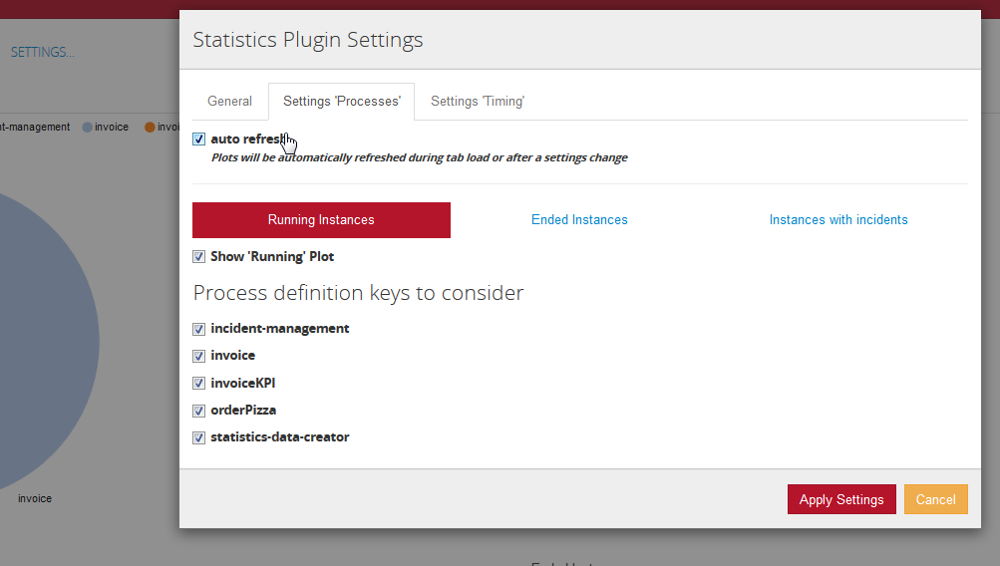
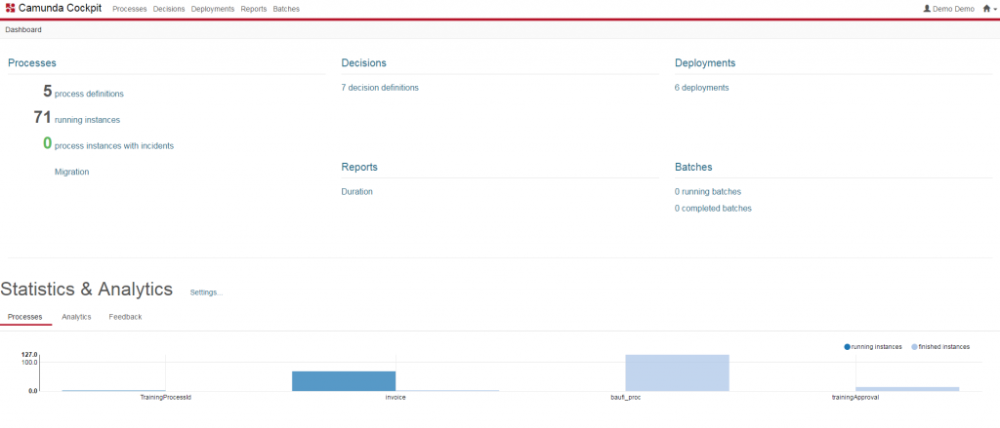
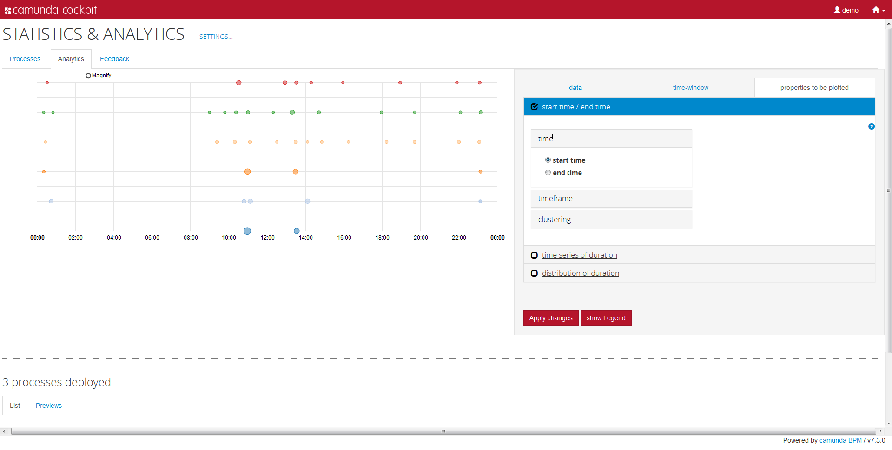
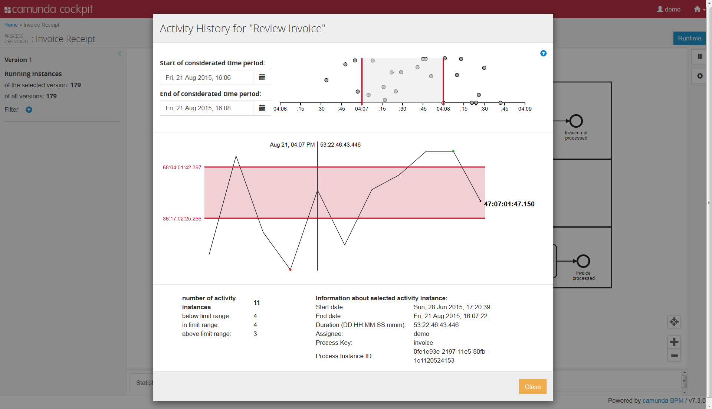
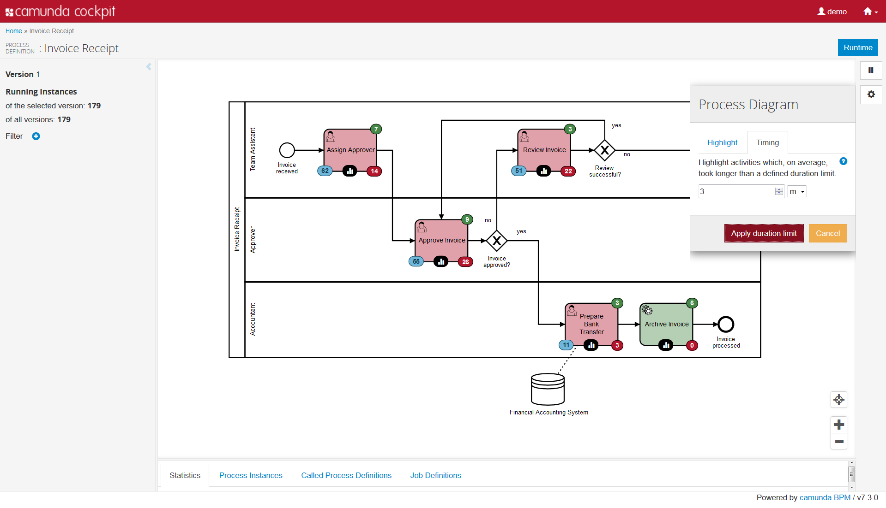

camunda Cockpit Statistics Plugin
=================================

This plugin is a camunda BPM community extension, which provides a statistics plugin for the camunda BPM Cockpit.
It provides a set of charts helping you to understand what is and what was going on with your engine.
The current master release was successfully tested on Camunda 7.4.0 Final with IBM DB2 9.7, MySQL 5.6 and H2 and is running on 7.3, too.
To get an initial overview on the different features please consider the following links:

[Introduction](http://blog.novatec-gmbh.de/camunda-cockpit-plugin-part-1/)

[Analytics](http://blog.novatec-gmbh.de/camunda-cockpit-plugin-part-2/)

[Process Diagram Overlay](http://blog.novatec-gmbh.de/camunda-cockpit-plugin-part-3/)

## Get started

To include this plugin into your cockpit you can either include it in your custom build on [camunda's plugin store](http://camunda.org/plugins/) or you build the cockpit on your own and deploy it to your server.
Do not forget to customize build.properties in case you choose the latter option. Please customize testdbs.properties.example, too to get the tests running on your system. Please see the provided maven profiles for further options.

## Known issues

**features we are working on**

- more fancy plots ;)
- generic dashboard mechanism

**todo**

- implement some kind of caching mechanism
- implement further graphs (cases)
- more (ui-driven) tests

**done**

- overlay information for rendered process diagram
- more analytics graphs
- db query tests for different databases
- drill-in/out for process instance / activity pie charts
- feedback mechanism
- general refactoring
- chart showing start and end times of process instances and activities per process definition
- chart showing start and end times of process instances and activities (all available)
- piechart of running, ended and failed process instances (all available)
- piechart of running and ended user tasks (all available)
- piechart of running and ended user tasks per process definition
- piechart of running, ended and failed process instances per process definition
- piechart of finished activities per process definition including information on avg, min, max duration and count

## Maintainer

[Eric Klieme](https://github.com/eklieme) ([NovaTec Consulting GmbH](http://www.novatec-gmbh.de/))

## Contributors

Within NovaTec Consulting GmbH the following persons are contributing

- [Ingo G&uuml;hring](http://blog.novatec-gmbh.de/camunda-cockpit-plugin-part-2/)
- [Kerstin G&uuml;nther](http://blog.novatec-gmbh.de/camunda-cockpit-plugin-part-3/)

## License

Apache License, Version 2.0
