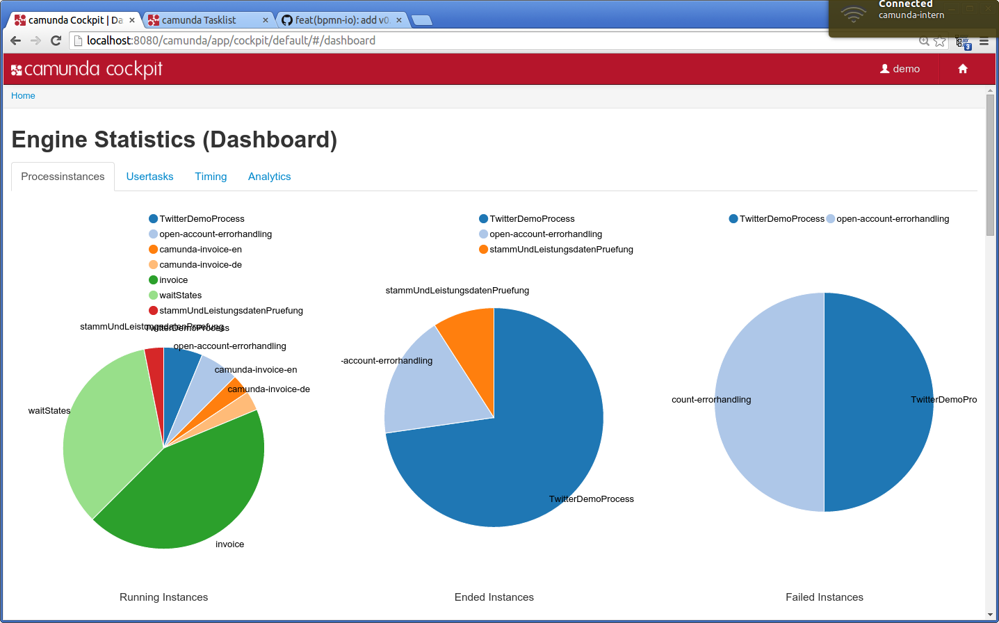
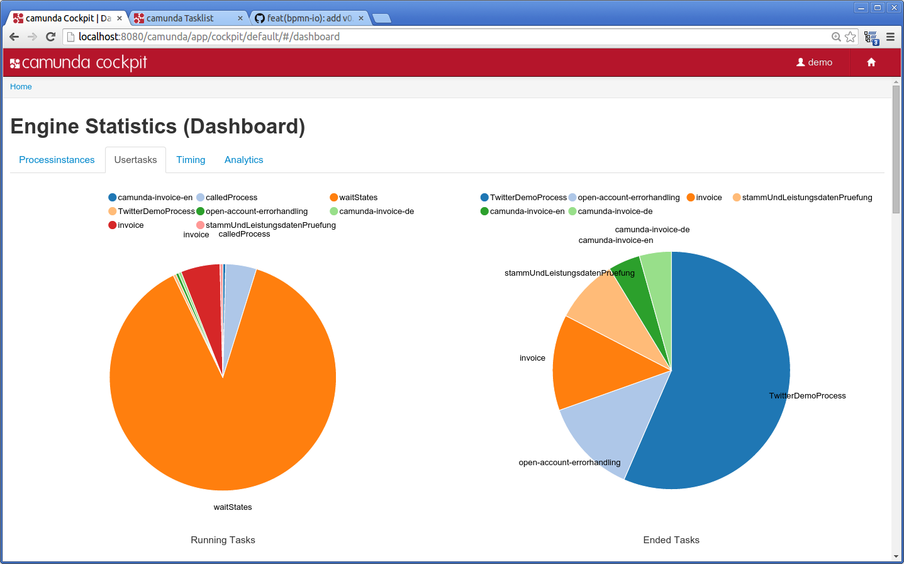

camunda Cockpit Statistics Plugin
=================================

camunda BPM community extension, which provides a statistics plugin for camunda Cockpit.
This plugin provides a set of charts helping you to understand what is and what was going on with your engine.
The current master release was successfully tested on an H2 and MySQL database with Camunda 7.1.0 Final.

## Get started

To include this plugin into your cockpit you can either include it in your custom build on [camunda's plugin store](http://camunda.org/plugins/) or you build the cockpit on your own and deploy it to your server.
Do not forget to customize build.properties in case you choose the latter option.

## Known issues

- Problems with queries on db2 
- Problems with "timing"-tab concerning a high count of activity or process instance start or end events

## Roadmap

**features we are working on**

- feedback mechanism
- drill-in/out for process instance / activity pie charts
- overlay information for rendered process diagram
- more analytics graphs
- general refactoring
- tests

**todo**

- implement some kind of caching mechanism
- implement a generic dashboard mechanism
- implement further graphs
- migration to version 7.2.0
- more tests

**done**
- chart showing start and end times of process instances and activities per process definition
- chart showing start and end times of process instances and activities (all available)
- piechart of running, ended and failed process instances (all available)
- piechart of running and ended user tasks (all available)
- piechart of running and ended user tasks per process definition
- piechart of running, ended and failed process instances per process definition
- piechart of finished activities per process definition including information on avg, min, max duration and count

## Maintainer

[Eric Klieme](https://github.com/eklieme) ([NovaTec Consulting GmbH](http://www.novatec-gmbh.de/))

## Contributors

Within NovaTec Consulting GmbH the following persons are contributing

- Ingo G&uuml;hring
- Benedict Gish
- Eberhard Heber

## License

Apache License, Version 2.0
