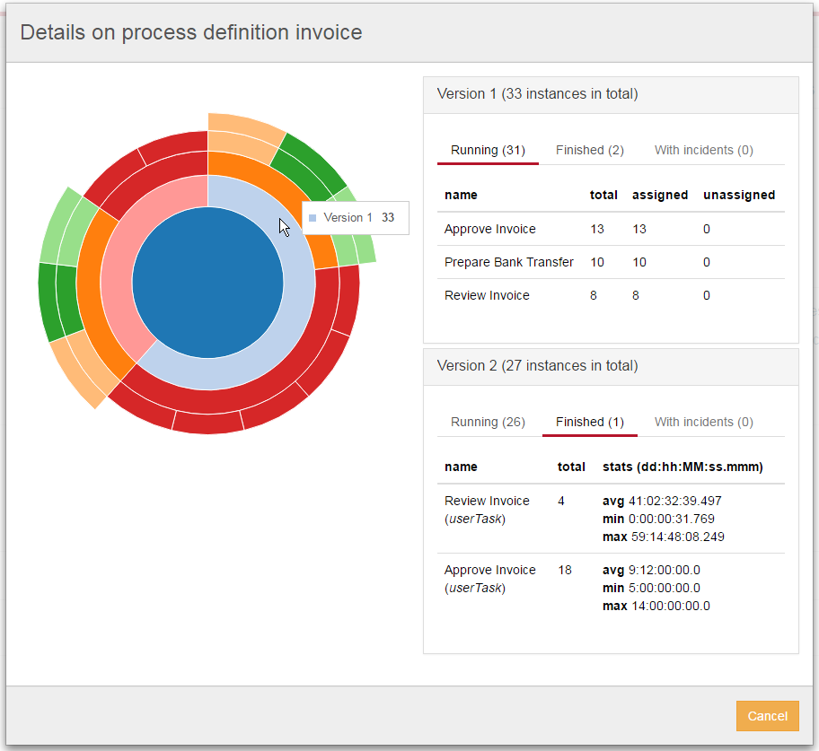
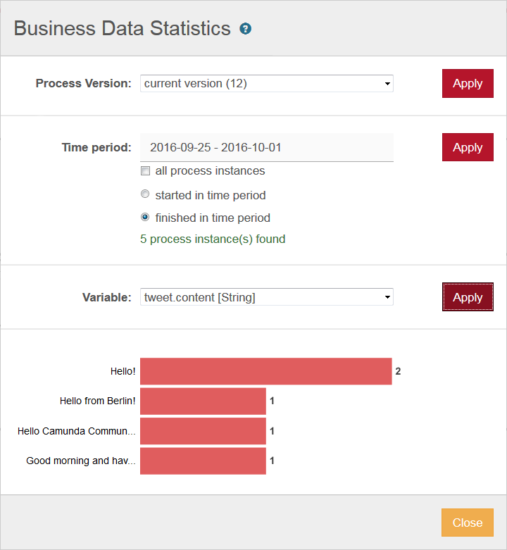
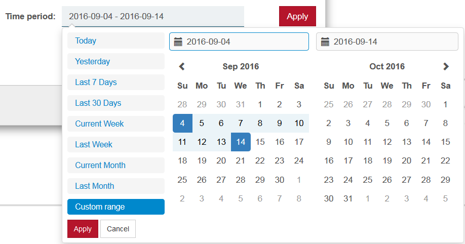
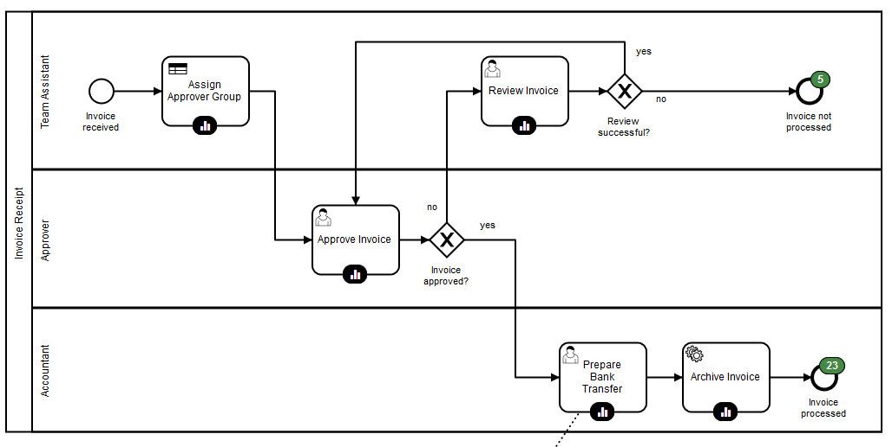
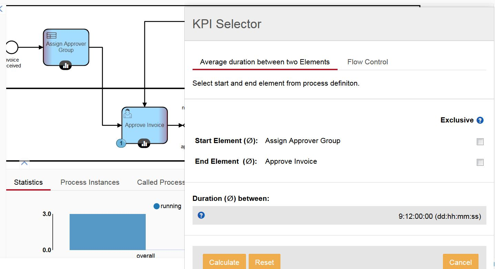

camunda Cockpit Statistics Plugin
=================================

This plugin is a camunda BPM community extension that provides a statistics plugin for the camunda BPM Cockpit.
It provides a set of charts helping you to understand what is and what was going on with your engine.
The current master was successfully tested on Camunda 7.6.0 Final (and 7.6.2 EE) with the H2 database provided by camunda.

Please feel free to share your system's setup for further working scenarios (please share any setup you experience trouble with, too ;) ).
To get an initial overview on the different features please consider the following links or take a quick tour through our [demo deployment](http://camunda-statistics-plugin.novatec.net):

[KPI & Business data statistics](http://blog.novatec-gmbh.de/kpi-functionality-camunda-cockpit-plugin/)

[Process Diagram Overlay](http://blog.novatec-gmbh.de/camunda-cockpit-plugin-part-3/)

[Analytics](http://blog.novatec-gmbh.de/camunda-cockpit-plugin-part-2/)

## Get started

To include this plugin into your cockpit you have to build the plugin on your own and deploy it to your server.
Depending on your server runtime you have to deploy the plugin jar to different locations as stated [here](https://docs.camunda.org/manual/latest/examples/tutorials/develop-cockpit-plugin/#integration-into-cockpit). 
Do not forget to customize build.properties in case you use the build.xml to auto-deploy to jboss. Please customize testdbs.properties.example, too to get the tests running on your system. Please see the provided maven profiles for further options.

## Maintainer

[Eric Klieme](https://github.com/eklieme) ([NovaTec Consulting GmbH](http://www.novatec-gmbh.de/))

## Contributors

Within NovaTec Consulting GmbH the following persons are contributing

- [Ingo G&uuml;hring](http://blog.novatec-gmbh.de/camunda-cockpit-plugin-part-2/)
- [Kerstin G&uuml;nther](http://blog.novatec-gmbh.de/camunda-cockpit-plugin-part-3/)

## License

Apache License, Version 2.0
